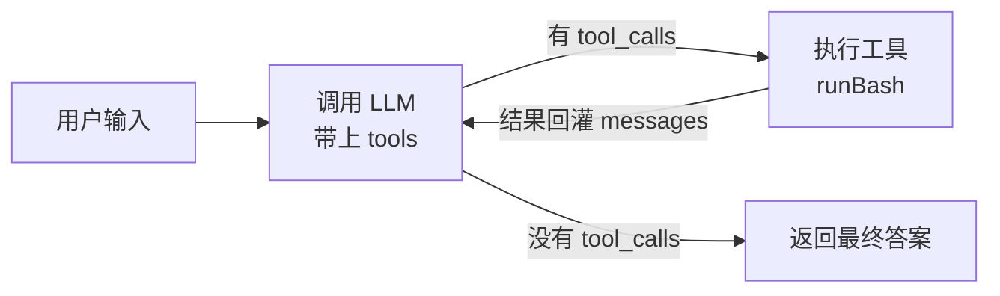

# s01：最小 agent loop —— 让模型会“用工具”

`s00` 只是一问一答。`s01` 加一件事：让模型能**调用工具**（这里只给它一个 `bash`）。
就这一步，把“聊天机器人”变成了“agent”。

## agent 的核心模式

一句话：**模型说要用工具 → 我们执行工具 → 把真实结果喂回模型 → 模型基于结果继续 → 直到它不再要工具、给出最终答案。**



这个“调用 → 执行 → 回灌 → 再调用”的环，就是 agent 的全部秘密。后面 18 节都只是在这个环外面加层。

## 关键：`tool_calls` 是什么规范

普通聊天里模型直接回文本。但当你在请求里带上 `tools`（工具的描述）后，模型多了一个选择：**不直接回答，而是回一个“我想调用某个工具、参数是什么”的意图**。这个意图就放在 `message.tool_calls` 里。

一个带工具调用的响应长这样（OpenAI 规范）：

```json
{
  "choices": [{
    "finish_reason": "tool_calls",
    "message": {
      "role": "assistant",
      "content": null,
      "tool_calls": [{
        "id": "call_abc123",
        "type": "function",
        "function": { "name": "bash", "arguments": "{\"command\":\"ls\"}" }
      }]
    }
  }]
}
```

三个要点，决定了代码为什么那样写：

1. **`finish_reason`**：是 `"tool_calls"` 说明模型还想调工具；否则（如 `"stop"`）说明这是最终答案——这就是 loop 的**退出条件**。
2. **`arguments` 是个 JSON 字符串**，不是对象。所以代码里要 `JSON.parse(...)` 才能拿到 `{ command: "ls" }`。
3. **`id`（tool_call_id）**：执行完工具，要把结果配上这个 id 塞回去，模型才知道“这是刚才那次调用的结果”。

回灌结果用一条 `tool` 角色的消息：

```js
{ role: "tool", tool_call_id: "call_abc123", content: "<bash 的输出>" }
```

## 为什么必须是循环

因为一次工具调用往往不够：模型 `ls` 看到文件后，可能还想 `cat` 某个文件，再决定下一步。每执行一次工具就产生新信息，模型要看到新信息才能继续。所以：**只要响应里还有 `tool_calls`，就执行 + 回灌 + 再问一遍**，直到模型给出不带工具的最终答案。

## 对应代码

- 主文件：[s01-agent-loop.js](./s01-agent-loop.js)
- 共用底座：[helper.js](./helper.js)

```js
const SYSTEM = `You are a coding agent at ${process.cwd()}. Use bash to solve tasks. Act, don't explain.`;

// 给模型看的工具描述（schema）
const bashTool = [{
  type: "function",
  function: {
    name: "bash",
    description: "Run a shell command.",
    parameters: { type: "object", properties: { command: { type: "string" } }, required: ["command"] },
  },
}];

export async function agentLoop(messages) {
  while (true) {
    const { message } = await callLlm(messages, { system: SYSTEM, tools: bashTool });

    // 没有 tool_calls → 模型给出最终答案，结束
    if (!message.tool_calls?.length) return message.content || "";

    // 先把模型这轮的回复（含工具调用意图）记进历史
    messages.push(message);

    // 执行每个工具调用，把结果回灌
    for (const call of message.tool_calls) {
      const { command } = JSON.parse(call.function.arguments || "{}");
      const output =
        call.function.name === "bash" ? runBash(command) : `Unknown tool: ${call.function.name}`;
      messages.push({ role: "tool", tool_call_id: call.id, content: output });
    }
  }
}
```

对照上面的图：`callLlm` 是“调用 LLM”，`if (!tool_calls)` 是“没有就返回答案”，`for` 里的 `runBash` + `push({ role: "tool" })` 是“执行工具 + 回灌”，外层 `while` 让它转下去。

两个容易漏的点：

- **模型那条 assistant 消息（带 `tool_calls`）也要 `push` 进 `messages`**，不能只回灌工具结果——否则模型会“忘了自己刚才要调工具”，对不上账。
- 决定“要不要调工具、调哪个”的是**模型**；代码只负责接住意图、执行、回灌。

## helper 函数语义化解释

| 名字 | 是什么 |
|---|---|
| `callLlm(messages, { system, tools })` | 还是那个唯一的 LLM 调用函数；这次多传了 `system`（角色设定）和 `tools`（工具描述），模型才可能返回 `tool_calls` |
| `runBash(command)` | `bash` 工具的实现：在工作目录执行一条 shell 命令，带危险命令拦截（`rm -rf /`、`sudo` 等直接挡掉）|

工具的**实现**（`runBash`）沉进 helper（管道、可复用），工具的**调度**（schema + 分发）留在主文件——这是 s01 想让你看清的边界。下一节 s02 会把“多个工具的分发”进一步抽成一张表。

## 怎么跑

```bash
node writing19/s01-agent-loop.js      # 例如输入：列出当前目录的 .js 文件
```

回归测试（本地假模型，脚本化一次“调 bash → 拿结果 → 给最终答案”）：

```bash
pnpm test:writing19
```

## 一句话总结

`s01` 教的不是 bash，而是 agent 的最小闭环：**带 tools 调模型 → 接住 `tool_calls` → 执行 → 回灌 → 循环，直到没有 `tool_calls`**。
